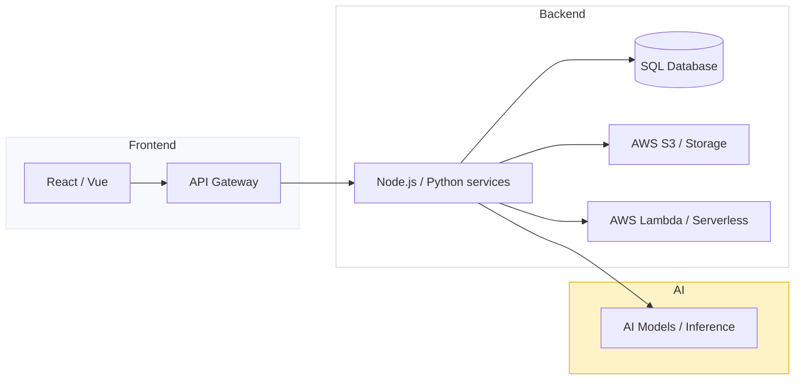

# Hi — I'm Ajinkya 👋

A pragmatic, mid‑level software engineer building reliable, user-focused web applications and backend services. I enjoy turning complex problems into simple, maintainable solutions — especially when performance, DX, and automation are involved.

---

## 🚀 Quick facts
- Role: Mid-level Software Engineer
- Focus: Web & backend, cloud infra, and applied AI
- Currently: Shipping features, improving code quality, and learning more about scalable systems

---

## 🧰 Skills

<p>
  
  
  
  
  
  
  
  
</p>

- Languages & frameworks: JavaScript (ES6+), Python, Node.js, React, Vue
- Databases & infra: SQL (Postgres/MySQL), AWS, CI/CD
- Interests: AI and Software Development

---

## ✨ Featured projects
```md
### Portfolio Website Template
- Repo: https://github.com/meAJINKYAr/portfolio
- Tech: flask, python, aws (lambda, api gateway and s3 bucket), zappa
- Summary: Portfolio website template for creating attractive portfolio websites
- Link: https://kejqahet02.execute-api.us-east-1.amazonaws.com/dev/index.html
```


## 🗺️ Architecture snapshot
A quick diagram of the type of stacks I work with:



(GitHub supports Mermaid diagrams in READMEs — if yours doesn't render, replace with a static image of the diagram.)

---

## 📈 GitHub stats
[](https://github.com/meAJINKYAr)
[](https://github.com/meAJINKYAr)

---

## 🤝 How to collaborate
- Open a GitHub issue or PR on one of my repos
- Reach out over email

---

## 📫 Contact
- Email: redeajinkya@gmail.com
- Portfolio: https://o0exubvyg9.execute-api.us-east-1.amazonaws.com/dev/

---
