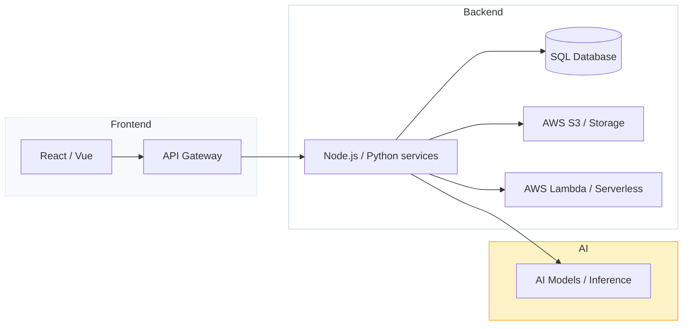

# Hi — I'm Ajinkya 👋

<p align="center">
  
</p>

A pragmatic, mid‑level software engineer building reliable, user-focused web applications and backend services. I enjoy turning complex problems into simple, maintainable solutions — especially when performance, DX, and automation are involved.

---

## 🚀 Quick facts
- Role: Mid-level Software Engineer
- Focus: Web & backend, cloud infra, and applied AI
- Currently: Shipping features, improving code quality, and learning more about scalable systems

---

## 🧰 Skills

<p>
  
  
  
  
  
  
  
  
</p>

- Languages & frameworks: JavaScript (ES6+), Python, Node.js, React, Vue
- Databases & infra: SQL (Postgres/MySQL), AWS (S3, Lambda, ECS/EKS), CI/CD
- Interests: performance optimization, developer experience, MLOps basics

---

## ✨ Featured projects
I’ll update these links & descriptions soon — paste your project details below or replace the placeholders.

- [project-1](https://github.com/meAJINKYAr/project-1) — Short one-line description of what it does and tech used.
- [project-2](https://github.com/meAJINKYAr/project-2) — Short one-liner + standout achievement (perf, scale, tests).
- [project-3](https://github.com/meAJINKYAr/project-3) — Short one-liner + links to demo/docs.

Want a nice project card? Use this template (copy/paste and edit):
```md
### Project name


- Repo: https://github.com/meAJINKYAr/repo-name
- Tech: Node.js, React, PostgreSQL, AWS
- Summary: Brief description (what problem it solves)
- Status: Live / WIP / Archived
```

---

## 🖼️ Showcase & Media
Add screenshots, GIFs or diagrams to highlight your work. Example gallery layout:

<p align="center">
  
  
  
</p>

Replace placeholders with your screenshots (store them in the repo's /assets or link to an external host).

---

## 🗺️ Architecture snapshot
A quick diagram of the type of stacks I work with:



(GitHub supports Mermaid diagrams in READMEs — if yours doesn't render, replace with a static image of the diagram.)

---

## 📈 GitHub stats
[](https://github.com/meAJINKYAr)
[](https://github.com/meAJINKYAr)

---

## 🤝 How to collaborate
- Open a GitHub issue or PR on one of my repos
- Ping me on LinkedIn / Twitter (links below)
- I’m open to mentoring interviews or pairing sessions focused on web apps and backend patterns

---

## 📫 Contact
- Email: your-email@example.com
- LinkedIn: https://linkedin.com/in/yourprofile
- Twitter: https://twitter.com/yourhandle
- Portfolio: https://your-portfolio.example

---

If you'd like, I can:
- Replace placeholder images with hosted screenshots (provide assets or grant repo access).
- Create polished project cards with badges, deployment/demo links, and screenshots.
- Add a GitHub Action to auto-update stats or show recent blog posts.

Thanks — tell me any text/images/links you'd like me to plug in and I’ll update the README for you.
